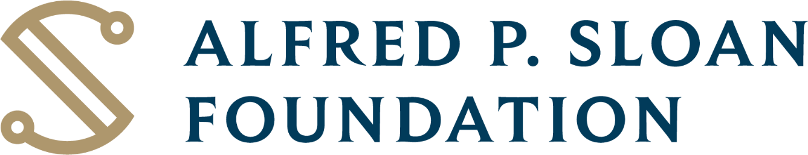
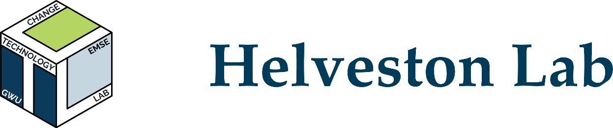

## Acknowledgments {.light-centered .center}

```{=html}
<div style="width:88%;margin:0 auto;background-image:radial-gradient(circle,#E0DBE5 0.6px,transparent 0.6px);background-size:18px 18px;padding:1.1em 1.2em;border-radius:18px;font-size:0.9em;">

 <div style="display:flex;flex-direction:column;gap:0.5em;">

  <div style="display:flex;align-items:center;gap:0.8em;background:#FFFFFF;border:1px solid #C7C1E5;border-radius:14px;padding:0.45em 1em;box-shadow:0 14px 32px rgba(86,84,162,0.14),0 2px 6px rgba(44,62,80,0.07);">
   <div style="width:1.9em;height:1.9em;border-radius:0.5em;background:#EEEDF8;border:1px solid #C7C1E5;display:flex;align-items:center;justify-content:center;color:#5654A2;flex-shrink:0;">
    <i data-lucide="graduation-cap" style="width:1em;height:1em;stroke-width:1.8;"></i>
   </div>
   <div style="text-align:left;">
    <div style="font-family:'Maple Mono',monospace;font-size:0.52em;letter-spacing:0.12em;text-transform:uppercase;font-weight:700;color:#5654A2;">Advisor</div>
    <div style="font-size:0.6em;font-weight:700;color:#2C3E50;line-height:1.25;">Dr. John Paul Helveston</div>
   </div>
  </div>

  <div style="display:flex;align-items:center;gap:0.8em;background:#FFFFFF;border:1px solid #BCDFC0;border-radius:14px;padding:0.45em 1em;box-shadow:0 14px 32px rgba(44,132,117,0.14),0 2px 6px rgba(44,62,80,0.07);">
   <div style="width:1.9em;height:1.9em;border-radius:0.5em;background:#E5F2EE;border:1px solid #BCDFC0;display:flex;align-items:center;justify-content:center;color:#2C8475;flex-shrink:0;">
    <i data-lucide="users" style="width:1em;height:1em;stroke-width:1.8;"></i>
   </div>
   <div style="text-align:left;">
    <div style="font-family:'Maple Mono',monospace;font-size:0.52em;letter-spacing:0.12em;text-transform:uppercase;font-weight:700;color:#2C8475;">Examining Committee</div>
    <div style="font-size:0.6em;font-weight:700;color:#2C3E50;line-height:1.25;">Dr. Caitlin Grady &middot; Dr. Johan Ren&eacute; van Dorp (presiding) &middot; Dr. Eric Hittinger</div>
   </div>
  </div>

  <div style="display:flex;align-items:center;gap:0.8em;background:#FFFFFF;border:1px solid #F0DDB4;border-radius:14px;padding:0.45em 1em;box-shadow:0 14px 32px rgba(196,136,26,0.14),0 2px 6px rgba(44,62,80,0.07);">
   <div style="width:1.9em;height:1.9em;border-radius:0.5em;background:#FEF5E7;border:1px solid #F0DDB4;display:flex;align-items:center;justify-content:center;color:#C4881A;flex-shrink:0;">
    <i data-lucide="handshake" style="width:1em;height:1em;stroke-width:1.8;"></i>
   </div>
   <div style="text-align:left;">
    <div style="font-family:'Maple Mono',monospace;font-size:0.52em;letter-spacing:0.12em;text-transform:uppercase;font-weight:700;color:#C4881A;">Research Teams</div>
    <div style="font-size:0.6em;font-weight:700;color:#2C3E50;line-height:1.25;">Smart charging team (GWU &middot; UC Davis &middot; UC Irvine &middot; RIT) &amp; the <span style="font-family:'Maple Mono',monospace;">surveydown</span> team</div>
   </div>
  </div>

  <div style="display:flex;align-items:center;gap:0.8em;background:#FFFFFF;border:1px solid #F0C5BA;border-radius:14px;padding:0.45em 1em;box-shadow:0 14px 32px rgba(212,95,71,0.14),0 2px 6px rgba(44,62,80,0.07);">
   <div style="width:1.9em;height:1.9em;border-radius:0.5em;background:#FCEEEC;border:1px solid #F0C5BA;display:flex;align-items:center;justify-content:center;color:#D45F47;flex-shrink:0;">
    <i data-lucide="heart" style="width:1em;height:1em;stroke-width:1.8;"></i>
   </div>
   <div style="text-align:left;">
    <div style="font-family:'Maple Mono',monospace;font-size:0.52em;letter-spacing:0.12em;text-transform:uppercase;font-weight:700;color:#D45F47;">Family</div>
    <div style="font-size:0.6em;font-weight:700;color:#2C3E50;line-height:1.25;">Mr. Sixiang Hu (father) &middot; Ms. Chunzhi Ping (mother) &middot; Ms. Yangyang Li (wife)</div>
   </div>
  </div>

 </div>

 <div style="height:1px;background:linear-gradient(90deg,transparent,#C4C3E8,transparent);margin-top:1em;"></div>

 <div style="display:flex;align-items:center;justify-content:center;gap:1.5em;margin-top:0.9em;">
  
  <div style="width:1px;height:2em;background:#2C3E50;opacity:0.35;"></div>
  
 </div>

</div>
```

::: {.notes}
Thanks to my advisor JP, my committee, the smart charging team across GWU, UC Davis, UC Irvine, and RIT, the surveydown team, and my family. This work was supported by the Alfred P. Sloan Foundation and conducted in the Helveston Lab.
:::

## EV sales in US reaching ~10% of sales {style="text-align: center;" .light-centered .center}

{fig-align="center" width="80%"}

::: {style="width: 80%; margin: 0 auto; text-align: right; font-size: 24px;"}
Source: Argonne National Lab, [www.anl.gov/ev-facts/model-sales](https://www.anl.gov/ev-facts/model-sales)
:::

## Introduction {.smaller .light-centered .center}

- **Unmanaged** BEV charging is becoming a problem to the grid.
- **Managed** charging is cheaper and smooths out the grid load.
- **Smart** charging: Supplier-Managed Charging (SMC) and Vehicle-to-Grid (V2G).

{fig-align="center" width="65%"}

::: {.notes}
Unmanaged BEV charging is becoming a problem to the grid due to the spike. That's why we need managed charging to smooth out the grid load as well as keep the price low.

Smart charging is a type of managed charging, which includes Supplier-Managed Charging, shortened as SMC, and Vehicle-to-Grid, shortened as V2G.
:::

## SMC - Supplier Managed Charging {.light-centered .center}

::: {style="font-size: 32px;"}
- SMC smooths out the BEV charging spike (called "Peak-shaving").
- Electricity demand is controlled below the capacity threshold.
- It saves money and reduces pollution.
:::

{fig-align="center" width="90%"}

::: {.notes}
For SMC, Supplier-Managed Charging, it smooths out the overnight BEV charging demand.

As you can see, with unmanaged charging, the BEV load easily exceeds the capacity threshold.
:::

## SMC - Supplier Managed Charging {.light-centered .center}

::: {style="font-size: 32px;"}
- SMC smooths out the BEV charging spike (called "Peak-shaving").
- Electricity demand is controlled below the capacity threshold.
- It saves money and reduces pollution.
:::

{fig-align="center" width="90%"}

::: {.notes}
But with SMC, the electricity demand is controlled below the threshold. It reduces the peak demand and saves money.
:::

## V2G - Vehicle-to-Grid {.light-centered .center}

{fig-align="center" width="70%"}

::: {.notes}
V2G is short for Vehicle-to-Grid. It is another type of smart charging that allows BEV owners to sell electricity back to the grid. With V2G, BEVs become potential sources of electricity.
:::

## Smart charging effectiveness depends on<br><span style="color: #2C8475;">enrollment</span> and <span style="color: #2C8475;">peak-shaving</span>. {.light-centered .center}

## Three Inter-connected Studies {.light-centered .center}

<br>

::: {.fragment}
#### <span style="color: #2C8475;">Survey Research & Modeling</span> {style="text-align: center;"}

::: {.centered-container style="width: 900px;"}
Battery Electric Vehicle Smart Charging Adoption
:::
:::

<br>

::: {.fragment .column}
#### <span style="color: #2C8475;">Simulation Research</span>

::: {.centered-container style="width: 400px;"}
Grid Peak-Shaving Quantification
:::
:::

::: {.fragment .column}
#### <span style="color: #2C8475;">Software Development</span> 

::: {.centered-container style="width: 400px;"}
The `surveydown` Survey Platform
:::
:::
