```{r}
#| label: setup-study-2
#| include: false
library(tidyverse)
library(kableExtra)
```

## <span style="color: #FFB84D;">Study 2</span><br>Quantifying the Peak-Shaving Potential and Cost Efficiency of BEV Supplier-Managed Charging {.dark-centered .center}

<br>

::: {style="font-size: 30px;"}
Submitted to *Environmental Research: Infrastructure and Sustainability*

<br>

Manuscript ERIS-100972, awaiting review
:::

## Recall the SMC Peak-shaving

::: {style="font-size: 32px;"}
- SMC smooths out EV charging spike (called "Peak-shaving").
- Electricity demand is controlled below capacity threshold.
- It saves money and reduces pollution.
:::

{fig-align="center" width="90%"}

::: {.notes}
Quick recall from Study 1: SMC shifts EV charging away from the evening peak, so the total demand stays below the capacity threshold.
:::

## Prior studies assume enrollment is high and free {style="line-height: 1.5;"}

1. Most grid studies **assume** optimal or near-100% participation [@tarroja_importance_2015], <span style="color: #739C69">but real pilots enroll far fewer</span>.
2. Enrollment is **not free**: utilities must pay incentives [@bailey_show_2023], <span style="color: #739C69">yet costs are rarely counted</span>.
3. Few studies compare peak-shaving **across grid regions** with different load shapes.

<br>

::: {.centered-container}
We connect **consumer enrollment** with **grid simulation**.
:::

::: {.notes}
The technical potential of managed charging is well documented, but most studies assume everyone participates for free. In reality, participation depends on incentives, and incentives cost money. That's the gap this study fills: we bring the empirical enrollment model from Study 1 into a grid-scale simulation.
:::

## Research Questions {style="line-height: 2;"}

1. **Peak-shaving**: How much can SMC reduce peak demand in contrasting grid regions?

2. **Cost efficiency**: How much does peak shaving cost per unit, and is more enrollment always better?

<br>

::: {.centered-container}
**Scenario-based simulation** for CAISO and NYISO.
:::

::: {.centered-container}
**Enrollment model**: incentives vs participation.
:::

## 18 GEA regions in the USA {.light-centered}

{fig-align="center" width="90%"}

::: {.notes}
The U.S. grid is divided into 18 Generation and Emissions Assessment regions, as defined by NREL's Cambium dataset. Our nationwide enrollment model applies to any of them.
:::

## 18 GEA regions in the USA {.light-centered}

{fig-align="center" width="90%"}

::: {.notes}
For the grid simulation, we zoom into two contrasting regions: CAISO in California and NYISO in New York.
:::

## {.light-centered .center}

::: {style="border: 2px solid #333; border-radius: 8px; padding: 6px 18px;"}

<table style="width: 100%; border-collapse: collapse; text-align: center; font-size: 30px; margin: 0;">
  <thead>
    <tr style="background-color: #F3F1E8;">
      <th style="width: 30%; padding: 14px 10px; border-right: 1px solid #333; border-bottom: 2px solid #333;"></th>
      <th style="width: 28%; padding: 14px 10px; border-right: 1px solid #333; border-bottom: 2px solid #333; font-size: 32px; color: #ED6D46;">CAISO</th>
      <th style="width: 42%; padding: 14px 10px; border-bottom: 2px solid #333; font-size: 32px; color: #739C69;">NYISO</th>
    </tr>
  </thead>
  <tbody>
    <tr>
      <td style="padding: 14px 10px; border-right: 1px solid #333; background-color: #F3F1E8;"><strong>Single Families</strong></td>
      <td style="padding: 14px 10px; border-right: 1px solid #333;">7.69 million</td>
      <td style="padding: 14px 10px;">3.16 million</td>
    </tr>
    <tr>
      <td style="padding: 14px 10px; border-top: 1px solid #333; border-right: 1px solid #333; background-color: #F3F1E8;"><strong>Energy Source</strong></td>
      <td style="padding: 14px 10px; border-top: 1px solid #333; border-right: 1px solid #333;">Solar</td>
      <td style="padding: 14px 10px; border-top: 1px solid #333;">Hydro</td>
    </tr>
    <tr>
      <td style="padding: 14px 10px; border-top: 1px solid #333; border-right: 1px solid #333; background-color: #F3F1E8;"><strong>Net load shape</strong></td>
      <td style="padding: 14px 10px; border-top: 1px solid #333; border-right: 1px solid #333;">Duck curve</td>
      <td style="padding: 14px 10px; border-top: 1px solid #333;">Flat profile</td>
    </tr>
    <tr>
      <td style="padding: 14px 10px; border-top: 1px solid #333; border-right: 1px solid #333; background-color: #F3F1E8;"><strong>Seasonal effect</strong></td>
      <td style="padding: 14px 10px; border-top: 1px solid #333; border-right: 1px solid #333;">Minimal</td>
      <td style="padding: 14px 10px; border-top: 1px solid #333;">Strong in winter (heating)</td>
    </tr>
  </tbody>
</table>

:::

<br>

::: {style="text-align: center; font-size: 28px;"}
Both **lead in BEV adoption**, with **contrasting grid structures**.
:::

::: {.notes}
We picked California and New York because they're both BEV leaders but structurally opposite grids. CAISO has the solar duck curve with a steep evening ramp, and it behaves essentially the same across all four seasons. NYISO is flatter, relies more on dispatchable hydro, and is season-sensitive: winter overnight heating keeps the nighttime load elevated, which matters later in the results. This contrast lets us see how grid context shapes SMC performance.
:::

## Data Sources {.light-centered .center}

<br>

::: {style="border: 2px solid #333; border-radius: 8px; padding: 6px 18px;"}

<table style="width: 100%; border-collapse: collapse; text-align: center; font-size: 28px; margin: 0;">
  <thead>
    <tr style="background-color: #F3F1E8;">
      <th style="width: 26%; padding: 12px 10px; border-right: 1px solid #333; border-bottom: 2px solid #333; font-size: 32px; color: #ED6D46;">Source</th>
      <th style="width: 38%; padding: 12px 10px; border-right: 1px solid #333; border-bottom: 2px solid #333; font-size: 32px; color: #739C69;">Provides</th>
      <th style="width: 36%; padding: 12px 10px; border-bottom: 2px solid #333; font-size: 32px; color: #5654A2;">Role in Simulation</th>
    </tr>
  </thead>
  <tbody>
    <tr>
      <td style="padding: 12px 10px; border-right: 1px solid #333;">2022 NHTS</td>
      <td style="padding: 12px 10px; border-right: 1px solid #333;">Real trip records nationwide</td>
      <td style="padding: 12px 10px;">Charge time &amp; energy needs</td>
    </tr>
    <tr>
      <td style="padding: 12px 10px; border-top: 1px solid #333; border-right: 1px solid #333;">2025 GridStatus.io</td>
      <td style="padding: 12px 10px; border-top: 1px solid #333; border-right: 1px solid #333;">Net load time series</td>
      <td style="padding: 12px 10px; border-top: 1px solid #333;">Regional grid baselines</td>
    </tr>
    <tr>
      <td style="padding: 12px 10px; border-top: 1px solid #333; border-right: 1px solid #333;">2025 U.S. Census</td>
      <td style="padding: 12px 10px; border-top: 1px solid #333; border-right: 1px solid #333;">Single-family counts</td>
      <td style="padding: 12px 10px; border-top: 1px solid #333;">Scale to total fleet energy</td>
    </tr>
    <tr>
      <td style="padding: 12px 10px; border-top: 1px solid #333; border-right: 1px solid #333;">Study 1</td>
      <td style="padding: 12px 10px; border-top: 1px solid #333; border-right: 1px solid #333;">Enrollment curve</td>
      <td style="padding: 12px 10px; border-top: 1px solid #333;">Cost efficiency analysis</td>
    </tr>
  </tbody>
</table>

:::

::: {.notes}
Four data sources: NHTS trips define when vehicles travel and how much energy they need; GridStatus.io gives us actual 2025 net load for both regions; the Census scales our 10,000 simulated vehicles up to regional fleet sizes; and crucially, the discrete choice experiment from Study 1 translates incentive dollars into enrollment rates. Net load means total consumption minus variable renewables, so it's the demand that dispatchable generation must serve.
:::

## Simulation Setup {.light-centered .center}

::: {.columns}
::: {.column style="padding-top: 0.5em; width: 48%;"}

::: {style="border: 2px solid #333; border-radius: 8px; padding: 4px 14px;"}

<table style="width: 100%; border-collapse: collapse; text-align: center; font-size: 26px; margin: 0;">
  <thead>
    <tr style="background-color: #F3F1E8;">
      <th colspan="2" style="padding: 12px 10px; border-bottom: 2px solid #333; font-size: 30px; color: #ED6D46; text-align: center;">Vehicle &amp; Charging</th>
    </tr>
  </thead>
  <tbody>
    <tr>
      <td style="width: 45%; padding: 12px 10px; border-right: 1px solid #333;">BEV range</td>
      <td style="width: 55%; padding: 12px 10px;">200 miles</td>
    </tr>
    <tr>
      <td style="padding: 12px 10px; border-top: 1px solid #333; border-right: 1px solid #333;">Charging</td>
      <td style="padding: 12px 10px; border-top: 1px solid #333;">Level 2 (6.48 kW)</td>
    </tr>
    <tr>
      <td style="padding: 12px 10px; border-top: 1px solid #333; border-right: 1px solid #333;">Battery SOC</td>
      <td style="padding: 12px 10px; border-top: 1px solid #333;">20% -- 80%</td>
    </tr>
    <tr>
      <td style="padding: 12px 10px; border-top: 1px solid #333; border-right: 1px solid #333;">Travel needs</td>
      <td style="padding: 12px 10px; border-top: 1px solid #333;">Guaranteed</td>
    </tr>
    <tr>
      <td style="padding: 12px 10px; border-top: 1px solid #333; border-right: 1px solid #333;">Overrides</td>
      <td style="padding: 12px 10px; border-top: 1px solid #333;">2 -- 3 per month</td>
    </tr>
  </tbody>
</table>

:::
:::

::: {.column style="width: 4%;"}
:::

::: {.column style="padding-top: 0.5em; width: 48%;"}

::: {style="border: 2px solid #333; border-radius: 8px; padding: 4px 14px;"}

<table style="width: 100%; border-collapse: collapse; text-align: center; font-size: 26px; margin: 0;">
  <thead>
    <tr style="background-color: #F3F1E8;">
      <th colspan="2" style="padding: 12px 10px; border-bottom: 2px solid #333; font-size: 30px; color: #739C69; text-align: center;">Program &amp; Scenarios</th>
    </tr>
  </thead>
  <tbody>
    <tr>
      <td style="width: 45%; padding: 12px 10px; border-right: 1px solid #333;">BEV : Household</td>
      <td style="width: 55%; padding: 12px 10px;">1 : 1</td>
    </tr>
    <tr>
      <td style="padding: 12px 10px; border-top: 1px solid #333; border-right: 1px solid #333;">Enrollment</td>
      <td style="padding: 12px 10px; border-top: 1px solid #333;">0% -- 100%</td>
    </tr>
    <tr>
      <td style="padding: 12px 10px; border-top: 1px solid #333; border-right: 1px solid #333;">Valley start</td>
      <td style="padding: 12px 10px; border-top: 1px solid #333;">8 PM -- 12 AM</td>
    </tr>
    <tr>
      <td style="padding: 12px 10px; border-top: 1px solid #333; border-right: 1px solid #333;">Best valley</td>
      <td style="padding: 12px 10px; border-top: 1px solid #333;"><strong>11 PM</strong></td>
    </tr>
    <tr>
      <td style="padding: 12px 10px; border-top: 1px solid #333; border-right: 1px solid #333;">Time spans</td>
      <td style="padding: 12px 10px; border-top: 1px solid #333;">Year / day / season</td>
    </tr>
  </tbody>
</table>

:::
:::
:::

::: {.notes}
Key assumptions: 200-mile BEVs on Level 2 home charging, batteries kept between 20 and 80 percent, and travel is never compromised — sessions that can't be shifted stay in place as override events, which stay within 2 to 3 per vehicle per month. We simulate the full range of enrollment levels and five time-of-use window configurations; the 11 PM valley start wins in both regions, so all reported results use it.
:::

## Workflow {.light-centered}

{fig-align="center" width="80%" .purple-border}

::: {style="font-size: 28px;"}
**Stage 1**: Peak-shaving model sweeps thousands of scenarios.<br>
**Stage 2**: Cost efficiency joins results with Study 1 enrollment curves.
:::

::: {.notes}
The framework has two stages. Stage one is the peak-shaving model: three data sources feed a simulation that sweeps TOU window configurations, adoption rates, date ranges, and enrollment levels. Stage two takes the best-performing outcomes and joins them with the consumer enrollment curve from Study 1 to compute cost efficiency frontiers.
:::

## Step 1: BEV Charging Load Profile {.light-centered}

{fig-align="center" width="85%" .purple-border}

::: {style="font-size: 30px;"}
Unmanaged charging of 10,000 simulated vehicles **peaks at 7 PM**.
:::

::: {.notes}
Step one builds the unmanaged BEV charging load from NHTS travel patterns. People come home in the evening and plug in, so the load peaks at 7 PM — exactly on top of the existing grid evening peak.
:::

## Step 2: BEV Load Peak Shaving {.light-centered}

{fig-align="center" width="85%" .purple-border}

::: {style="font-size: 28px;"}
**Five configurations** with different peak/valley windows.
:::

::: {.notes}
Two messages in this plot. First, besides the baseline, there are five configurations that differ only in when the valley window opens — from 8 PM to 12 AM — so we can directly compare which peak/valley allocation shaves the most. Second, this is drawn at 50% enrollment, not 0 or 100, so you can see the interim shifting: half of the fleet's charging has moved into the valley, and the other half still charges as usual. Mechanically, from 10 AM charging is suppressed unless the battery would fall below 20% or tomorrow's travel would be at risk, and deferred demand is delivered at maximum rate once the valley opens.
:::

## Step 3: Grid Net Load Profile {.light-centered}

{fig-align="center" width="85%" .purple-border}

::: {style="font-size: 28px;"}
Net Load = Grid Supply - Variable Sources
:::

::: {.notes}
Step three is the grid baseline. CAISO's 2025 average net load shows the classic duck curve: a midday dip from solar and a steep evening ramp. The evening peak and overnight valley together define the opportunity window for SMC. We plot days starting at 7 AM so the peak sits in the center and the valley forms one contiguous block on the right.
:::

## Step 4: Net Load + BEV & Peak Shaving {.light-centered}

{fig-align="center" width="85%" .purple-border}

::: {style="font-size: 28px;"}
BEV load scaled to fleet size and stacked on net load.
:::

::: {.notes}
Step four stacks the scaled BEV load on the grid baseline. Each simulated vehicle represents 769 vehicles in CAISO and 316 in NYISO. The black line is total load with no SMC; the green line is full enrollment — the evening peak drops and the load moves into the overnight valley.
:::

## Enrollment Curve from Study 1 {.light-centered}

{fig-align="center" width="85%" .purple-border}

::: {style="font-size: 28px;"}
Mixed logit prediction based on ~1300 real BEV owners.
:::

::: {.notes}
This is the bridge between the two studies. The mixed logit model from Study 1, holding non-monetary attributes fixed, gives the enrollment rate as a function of the monthly incentive. About 30% would participate with no payment at all, \$20 a month gets you to about 60%, but full enrollment would take \$85 per household per month. The curve is concave — every additional dollar buys less enrollment — and since utilities pay a uniform incentive to everyone, total program cost grows non-linearly.
:::

## Step 5: Cost Efficiency Analysis {.light-centered}

{fig-align="center" width="85%" .purple-border}

::: {style="font-size: 28px;"}
Program cost [=]{style="font-family: 'Palatino Linotype', Palatino, serif;"} incentive [×]{style="font-family: 'Palatino Linotype', Palatino, serif;"} number of enrolled households.
:::

::: {.notes}
Step five joins the peak-shaving results with the enrollment curve. Each dot along a curve is a 10% enrollment step. The dots spread out along the cost axis at higher enrollment: attracting marginal participants requires raising the payment for all existing enrollees, so marginal costs rise sharply.
:::

## Results {.dark-centered .center}

## Annual Average Peak Shaving {.light-centered .center}

::: {style="border: 2px solid #333; border-radius: 8px; padding: 6px 18px;"}

<table style="width: 100%; border-collapse: collapse; text-align: center; font-size: 30px; margin: 0;">
  <thead>
    <tr style="background-color: #F3F1E8;">
      <th colspan="2" style="width: 50%; padding: 12px 10px; border-right: 1px solid #333; border-bottom: 2px solid #333; font-size: 32px; color: #ED6D46; text-align: center;">CAISO</th>
      <th colspan="2" style="width: 50%; padding: 12px 10px; border-bottom: 2px solid #333; font-size: 32px; color: #739C69; text-align: center;">NYISO</th>
    </tr>
  </thead>
  <tbody>
    <tr>
      <td colspan="2" style="padding: 10px; border-right: 1px solid #333; text-align: center;">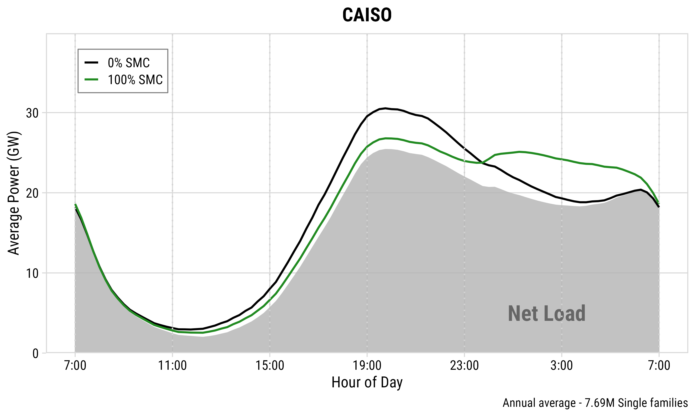</td>
      <td colspan="2" style="padding: 10px; text-align: center;">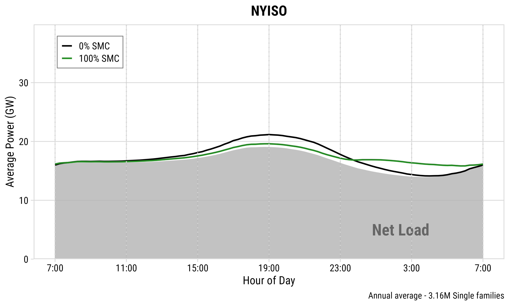</td>
    </tr>
    <tr>
      <td style="width: 17%; padding: 14px 10px; border-top: 1px solid #333; border-right: 1px solid #333; background-color: #F3F1E8;"><strong>Peak shave</strong></td>
      <td style="width: 33%; padding: 14px 10px; border-top: 1px solid #333; border-right: 1px solid #333; text-align: center;">3.7 GW (30.5 → 26.8)</td>
      <td style="width: 17%; padding: 14px 10px; border-top: 1px solid #333; border-right: 1px solid #333; background-color: #F3F1E8;"><strong>Peak shave</strong></td>
      <td style="width: 33%; padding: 14px 10px; border-top: 1px solid #333; text-align: center;">1.6 GW (21.2 → 19.6)</td>
    </tr>
    <tr>
      <td style="padding: 14px 10px; border-top: 1px solid #333; border-right: 1px solid #333; background-color: #F3F1E8;"><strong>Percentage</strong></td>
      <td style="padding: 14px 10px; border-top: 1px solid #333; border-right: 1px solid #333; text-align: center;">12.1%</td>
      <td style="padding: 14px 10px; border-top: 1px solid #333; border-right: 1px solid #333; background-color: #F3F1E8;"><strong>Percentage</strong></td>
      <td style="padding: 14px 10px; border-top: 1px solid #333; text-align: center;">7.5%</td>
    </tr>
  </tbody>
</table>

:::

::: {.notes}
On an annual average day with full enrollment, SMC shaves 3.7 gigawatts off CAISO's evening peak — about 12% — and 1.6 gigawatts in NYISO, about 7.5%. CAISO does better both because it has more households and because its deep overnight valley absorbs the deferred charging.
:::

## Extreme Days: [CAISO]{style="color: #ED6D46;"} {.light-centered .center}

::: {style="border: 2px solid #333; border-radius: 8px; padding: 6px 18px;"}

<table style="width: 100%; border-collapse: collapse; font-size: 30px; margin: 0;">
  <thead>
    <tr style="background-color: #F3F1E8;">
      <th colspan="2" style="width: 50%; padding: 12px 10px; border-right: 1px solid #333; border-bottom: 2px solid #333; font-size: 32px; color: #2980B9; text-align: center;">Best Day (Jun 1)</th>
      <th colspan="2" style="width: 50%; padding: 12px 10px; border-bottom: 2px solid #333; font-size: 32px; color: #E74C3C; text-align: center;">Worst Day (Dec 13)</th>
    </tr>
  </thead>
  <tbody>
    <tr>
      <td colspan="2" style="padding: 10px; border-right: 1px solid #333; text-align: center;">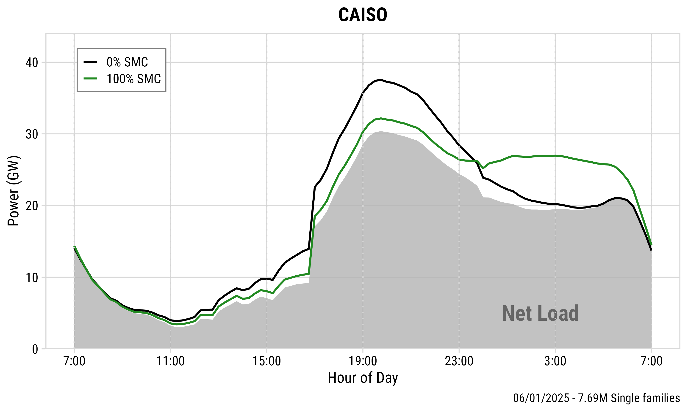</td>
      <td colspan="2" style="padding: 10px; text-align: center;">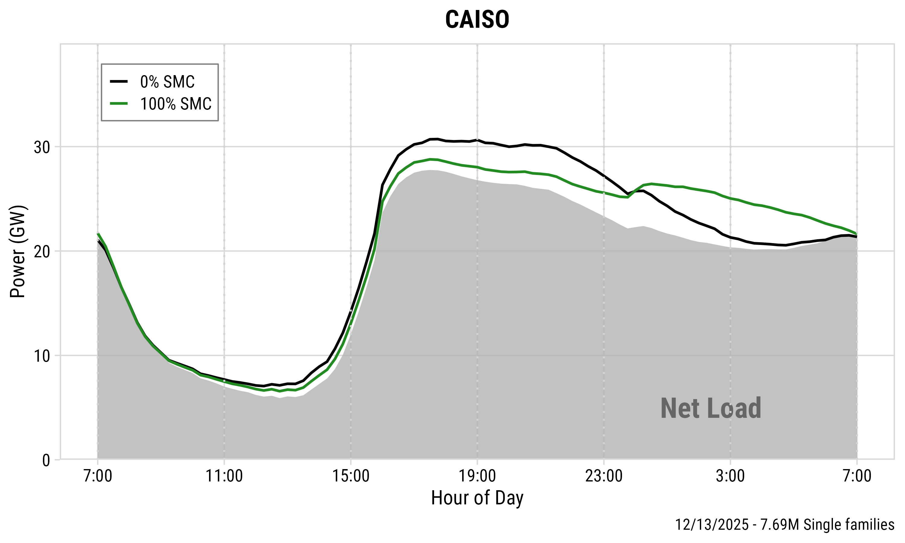</td>
    </tr>
    <tr>
      <td style="width: 17%; padding: 14px 10px; border-top: 1px solid #333; border-right: 1px solid #333; background-color: #F3F1E8;"><strong>Peak shave</strong></td>
      <td style="width: 33%; padding: 14px 10px; border-top: 1px solid #333; border-right: 1px solid #333; text-align: center;">5.4 GW (37.6 → 32.2)</td>
      <td style="width: 17%; padding: 14px 10px; border-top: 1px solid #333; border-right: 1px solid #333; background-color: #F3F1E8;"><strong>Peak shave</strong></td>
      <td style="width: 33%; padding: 14px 10px; border-top: 1px solid #333; text-align: center;">1.9 GW (30.7 → 28.8)</td>
    </tr>
    <tr>
      <td style="padding: 14px 10px; border-top: 1px solid #333; border-right: 1px solid #333; background-color: #F3F1E8;"><strong>Percentage</strong></td>
      <td style="padding: 14px 10px; border-top: 1px solid #333; border-right: 1px solid #333; text-align: center;">14.4%</td>
      <td style="padding: 14px 10px; border-top: 1px solid #333; border-right: 1px solid #333; background-color: #F3F1E8;"><strong>Percentage</strong></td>
      <td style="padding: 14px 10px; border-top: 1px solid #333; text-align: center;">6.2%</td>
    </tr>
  </tbody>
</table>

:::

::: {.notes}
Performance varies a lot day to day. CAISO's best day shaves 5.4 gigawatts, its worst under 2. Important nuance: extreme days are ranked by how much peak can be shaved, not by how high the peak is — on heat-wave days, air conditioning dominates and EV charging is a small share, so SMC has less leverage.
:::

## Extreme Days: [NYISO]{style="color: #739C69;"} {.light-centered .center}

::: {style="border: 2px solid #333; border-radius: 8px; padding: 6px 18px;"}

<table style="width: 100%; border-collapse: collapse; font-size: 30px; margin: 0;">
  <thead>
    <tr style="background-color: #F3F1E8;">
      <th colspan="2" style="width: 50%; padding: 12px 10px; border-right: 1px solid #333; border-bottom: 2px solid #333; font-size: 32px; color: #2980B9; text-align: center;">Best Day (Jul 13)</th>
      <th colspan="2" style="width: 50%; padding: 12px 10px; border-bottom: 2px solid #333; font-size: 32px; color: #E74C3C; text-align: center;">Worst Day (Nov 8)</th>
    </tr>
  </thead>
  <tbody>
    <tr>
      <td colspan="2" style="padding: 10px; border-right: 1px solid #333; text-align: center;">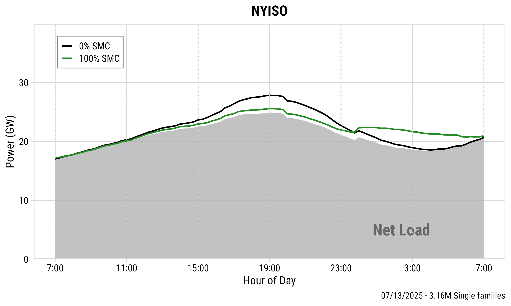</td>
      <td colspan="2" style="padding: 10px; text-align: center;">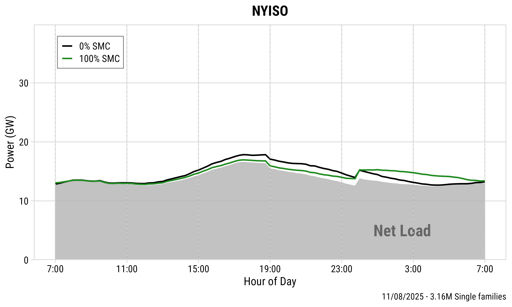</td>
    </tr>
    <tr>
      <td style="width: 17%; padding: 14px 10px; border-top: 1px solid #333; border-right: 1px solid #333; background-color: #F3F1E8;"><strong>Peak shave</strong></td>
      <td style="width: 33%; padding: 14px 10px; border-top: 1px solid #333; border-right: 1px solid #333; text-align: center;">2.2 GW (27.8 → 25.6)</td>
      <td style="width: 17%; padding: 14px 10px; border-top: 1px solid #333; border-right: 1px solid #333; background-color: #F3F1E8;"><strong>Peak shave</strong></td>
      <td style="width: 33%; padding: 14px 10px; border-top: 1px solid #333; text-align: center;">0.8 GW (17.8 → 17.0)</td>
    </tr>
    <tr>
      <td style="padding: 14px 10px; border-top: 1px solid #333; border-right: 1px solid #333; background-color: #F3F1E8;"><strong>Percentage</strong></td>
      <td style="padding: 14px 10px; border-top: 1px solid #333; border-right: 1px solid #333; text-align: center;">7.9%</td>
      <td style="padding: 14px 10px; border-top: 1px solid #333; border-right: 1px solid #333; background-color: #F3F1E8;"><strong>Percentage</strong></td>
      <td style="padding: 14px 10px; border-top: 1px solid #333; text-align: center;">4.5%</td>
    </tr>
  </tbody>
</table>

:::

::: {.notes}
NYISO's day-to-day range is narrower: the best day shaves 2.2 gigawatts, the worst 0.8. Same ranking nuance applies — days are ranked by achievable shaving, not by demand level.
:::

## Cost Efficiency: Diminishing Returns {.light-centered}

::: {.columns}
::: {.column}
{fig-align="center" width="100%" .purple-border}
:::

::: {.column}
{fig-align="center" width="100%" .purple-border}
:::
:::

::: {style="text-align: center; font-size: 28px;"}
Cost efficiency is highest at moderate enrollment (**30–50%**).
:::

::: {.notes}
Here's the central result. Each dot is a 10% enrollment step, and the dots stretch out along the cost axis — the last increments of enrollment are extremely expensive. Moderate enrollment, 30 to 50 percent, captures most of the achievable peak reduction at a fraction of the cost. And on about 15% of CAISO days, pushing enrollment too high actually reconstitutes a new overnight peak.
:::

## Seasonal Patterns: [CAISO]{style="color: #ED6D46;"} {.light-centered .center}

::: {style="border: 2px solid #333; border-radius: 8px; padding: 6px 18px;"}

<table style="width: 100%; border-collapse: collapse; font-size: 28px; margin: 0;">
  <thead>
    <tr style="background-color: #F3F1E8;">
      <th style="width: 25%; padding: 12px 10px; border-right: 1px solid #333; border-bottom: 2px solid #333; font-size: 30px; text-align: center;">Spring</th>
      <th style="width: 25%; padding: 12px 10px; border-right: 1px solid #333; border-bottom: 2px solid #333; font-size: 30px; text-align: center;">Summer</th>
      <th style="width: 25%; padding: 12px 10px; border-right: 1px solid #333; border-bottom: 2px solid #333; font-size: 30px; text-align: center;">Fall</th>
      <th style="width: 25%; padding: 12px 10px; border-bottom: 2px solid #333; font-size: 30px; text-align: center;">Winter</th>
    </tr>
  </thead>
  <tbody>
    <tr>
      <td style="padding: 6px; border-right: 1px solid #333; text-align: center;">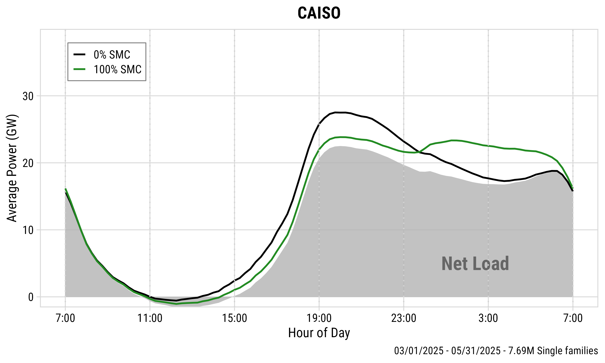</td>
      <td style="padding: 6px; border-right: 1px solid #333; text-align: center;">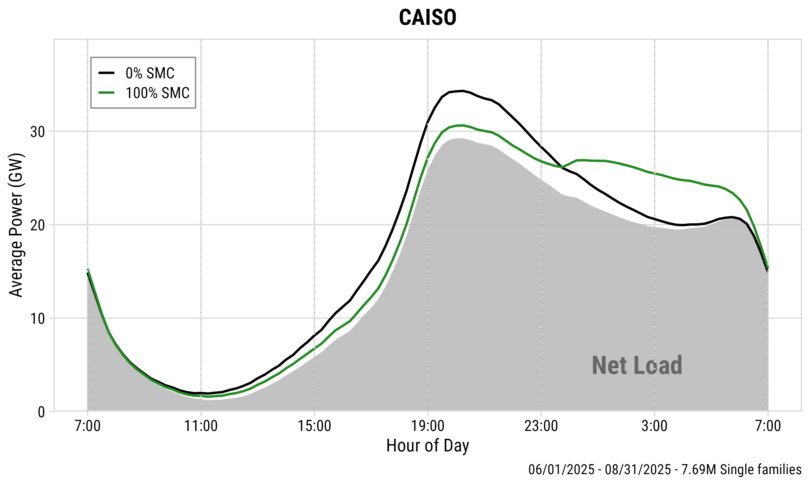</td>
      <td style="padding: 6px; border-right: 1px solid #333; text-align: center;">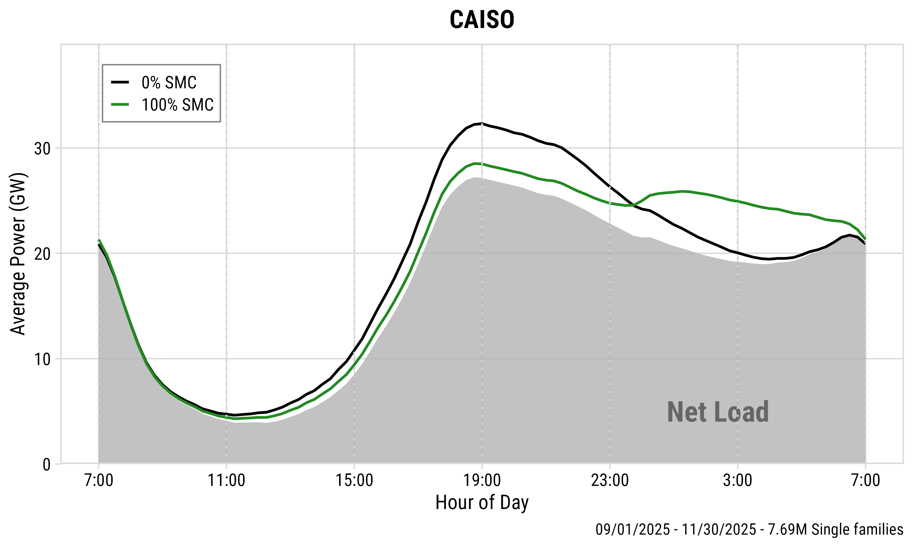</td>
      <td style="padding: 6px; text-align: center;">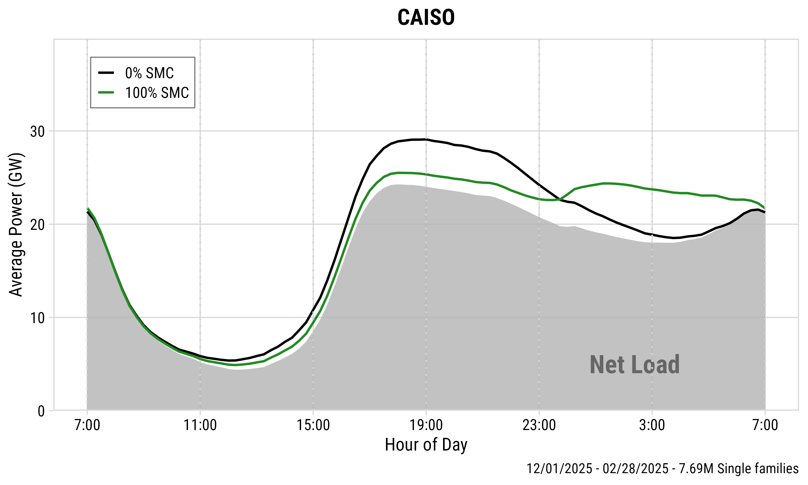</td>
    </tr>
    <tr>
      <td style="padding: 12px 6px; border-top: 1px solid #333; border-right: 1px solid #333; text-align: center; font-size: 24px;">3.7 GW (27.5 → 23.8)</td>
      <td style="padding: 12px 6px; border-top: 1px solid #333; border-right: 1px solid #333; text-align: center; font-size: 24px;">3.7 GW (34.3 → 30.6)</td>
      <td style="padding: 12px 6px; border-top: 1px solid #333; border-right: 1px solid #333; text-align: center; font-size: 24px;">3.8 GW (32.3 → 28.5)</td>
      <td style="padding: 12px 6px; border-top: 1px solid #333; text-align: center; font-size: 24px;">3.6 GW (29.1 → 25.5)</td>
    </tr>
    <tr>
      <td style="padding: 12px 6px; border-top: 1px solid #333; border-right: 1px solid #333; text-align: center; font-size: 24px;">13.5%</td>
      <td style="padding: 12px 6px; border-top: 1px solid #333; border-right: 1px solid #333; text-align: center; font-size: 24px;">10.8%</td>
      <td style="padding: 12px 6px; border-top: 1px solid #333; border-right: 1px solid #333; text-align: center; font-size: 24px;">11.8%</td>
      <td style="padding: 12px 6px; border-top: 1px solid #333; text-align: center; font-size: 24px;">12.4%</td>
    </tr>
    <tr>
      <td colspan="4" style="padding: 12px 10px; border-top: 1px solid #333; text-align: center;">Peak shave for all seasons: <strong>3.6–3.8 GW (10.8–13.5%)</strong></td>
    </tr>
  </tbody>
</table>

:::

::: {.notes}
Seasonally, CAISO is remarkably consistent — 3.6 to 3.8 gigawatts in every season, because the solar-shaped profile keeps the peak-to-valley gap wide year-round. Summer has the highest absolute peak from air conditioning, but the shaving potential barely moves.
:::

## Seasonal Patterns: [NYISO]{style="color: #739C69;"} {.light-centered .center}

::: {style="border: 2px solid #333; border-radius: 8px; padding: 6px 18px;"}

<table style="width: 100%; border-collapse: collapse; font-size: 28px; margin: 0;">
  <thead>
    <tr style="background-color: #F3F1E8;">
      <th style="width: 25%; padding: 12px 10px; border-right: 1px solid #333; border-bottom: 2px solid #333; font-size: 30px; text-align: center;">Spring</th>
      <th style="width: 25%; padding: 12px 10px; border-right: 1px solid #333; border-bottom: 2px solid #333; font-size: 30px; text-align: center;">Summer</th>
      <th style="width: 25%; padding: 12px 10px; border-right: 1px solid #333; border-bottom: 2px solid #333; font-size: 30px; text-align: center;">Fall</th>
      <th style="width: 25%; padding: 12px 10px; border-bottom: 2px solid #333; font-size: 30px; text-align: center;">Winter</th>
    </tr>
  </thead>
  <tbody>
    <tr>
      <td style="padding: 6px; border-right: 1px solid #333; text-align: center;">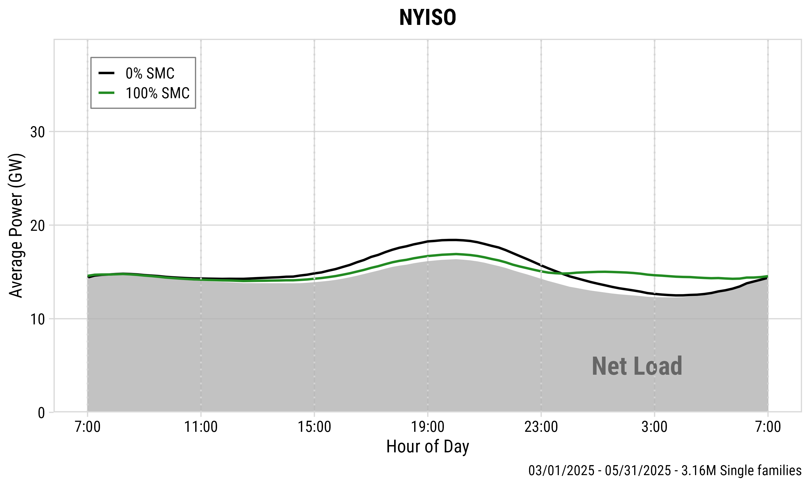</td>
      <td style="padding: 6px; border-right: 1px solid #333; text-align: center;">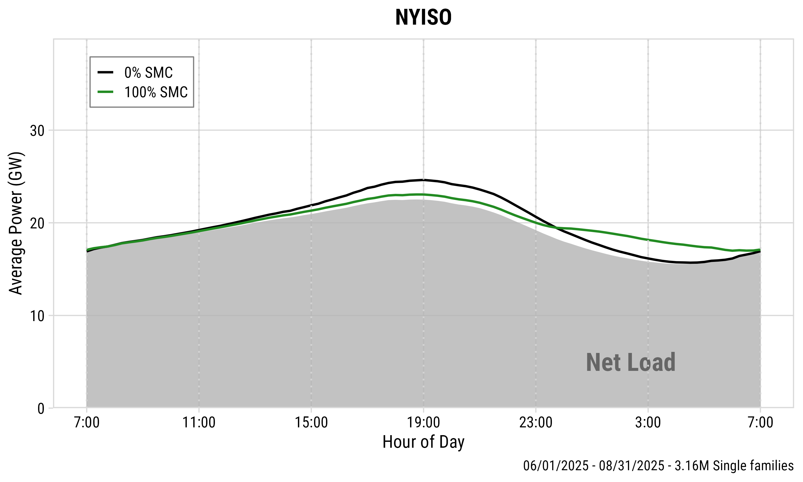</td>
      <td style="padding: 6px; border-right: 1px solid #333; text-align: center;">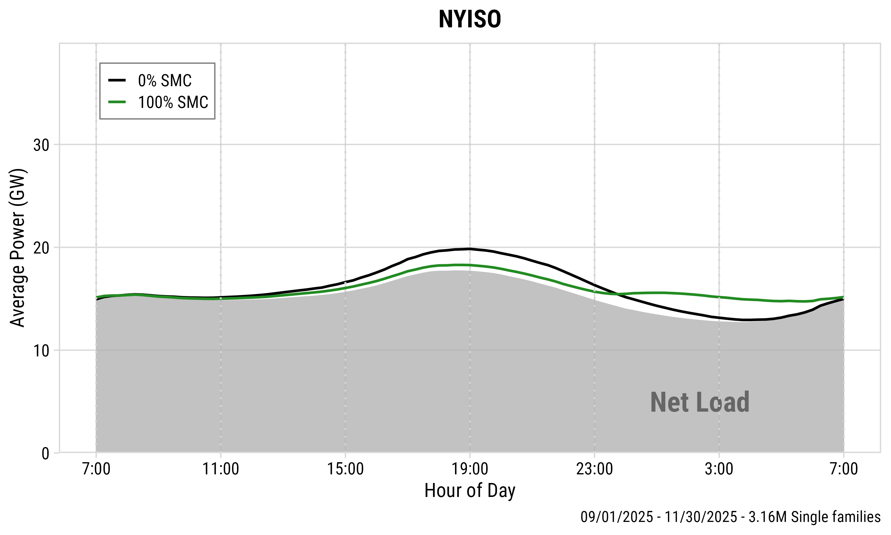</td>
      <td style="padding: 6px; text-align: center;">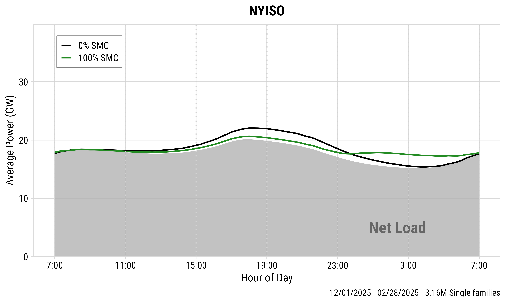</td>
    </tr>
    <tr>
      <td style="padding: 12px 6px; border-top: 1px solid #333; border-right: 1px solid #333; text-align: center; font-size: 24px;">1.5 GW (18.4 → 16.9)</td>
      <td style="padding: 12px 6px; border-top: 1px solid #333; border-right: 1px solid #333; text-align: center; font-size: 24px;">1.6 GW (24.6 → 23.0)</td>
      <td style="padding: 12px 6px; border-top: 1px solid #333; border-right: 1px solid #333; text-align: center; font-size: 24px;">1.5 GW (19.8 → 18.3)</td>
      <td style="padding: 12px 6px; border-top: 1px solid #333; text-align: center; font-size: 24px;">1.4 GW (22.1 → 20.7)</td>
    </tr>
    <tr>
      <td style="padding: 12px 6px; border-top: 1px solid #333; border-right: 1px solid #333; text-align: center; font-size: 24px;">8.2%</td>
      <td style="padding: 12px 6px; border-top: 1px solid #333; border-right: 1px solid #333; text-align: center; font-size: 24px;">6.5%</td>
      <td style="padding: 12px 6px; border-top: 1px solid #333; border-right: 1px solid #333; text-align: center; font-size: 24px;">7.6%</td>
      <td style="padding: 12px 6px; border-top: 1px solid #333; text-align: center; font-size: 24px;">6.3%</td>
    </tr>
    <tr>
      <td colspan="4" style="padding: 12px 10px; border-top: 1px solid #333; text-align: center;">Peak shave for all seasons: <strong>1.4–1.6 GW (6.3–8.2%)</strong></td>
    </tr>
  </tbody>
</table>

:::

::: {.notes}
NYISO's winter is the exception: overnight space heating keeps the valley elevated, leaving less room for deferred charging — the smallest seasonal shaving at 1.4 gigawatts. The other three seasons cluster at 1.5 to 1.6.
:::

## Seasonal Cost Efficiency {.light-centered}

::: {.columns}
::: {.column}
{fig-align="center" width="100%" .purple-border}
:::

::: {.column}
{fig-align="center" width="100%" .purple-border}
:::
:::

::: {style="text-align: center; font-size: 28px;"}
Seasonal cost efficiency is consistent in **CAISO**.
:::

::: {.notes}
The efficiency frontiers by season tell the same story: CAISO's four curves nearly overlap, so a year-round program delivers consistent value. NYISO's winter curve sits below the others at every enrollment level — utilities there may need seasonal enrollment targets or incentive levels.
:::

## How Do Real Programs Compare? {.light-centered .center}

::: {style="border: 2px solid #333; border-radius: 8px; padding: 6px 18px;"}

<table style="width: 100%; border-collapse: collapse; font-size: 26px; margin: 0;">
  <thead>
    <tr style="background-color: #F3F1E8;">
      <th style="width: 36%; padding: 12px 10px; border-right: 1px solid #333; border-bottom: 2px solid #333; font-size: 28px; text-align: center;">Program</th>
      <th style="width: 34%; padding: 12px 10px; border-right: 1px solid #333; border-bottom: 2px solid #333; font-size: 28px; text-align: center;">Incentive</th>
      <th style="width: 30%; padding: 12px 10px; border-bottom: 2px solid #333; font-size: 28px; text-align: center;">Enrollment</th>
    </tr>
  </thead>
  <tbody>
    <tr>
      <td style="padding: 14px 10px; border-right: 1px solid #333; text-align: center;">PCE Managed Charging<br>[(CAISO)]{style="color: #ED6D46;"}</td>
      <td style="padding: 14px 10px; border-right: 1px solid #333; text-align: center;">$0 → $40 per month</td>
      <td style="padding: 14px 10px; text-align: center;">1.4% → 10.6%</td>
    </tr>
    <tr>
      <td style="padding: 14px 10px; border-top: 1px solid #333; border-right: 1px solid #333; text-align: center;">MCE Sync<br>[(CAISO)]{style="color: #ED6D46;"}</td>
      <td style="padding: 14px 10px; border-top: 1px solid #333; border-right: 1px solid #333; text-align: center;">$50 bonus + $10 per month</td>
      <td style="padding: 14px 10px; border-top: 1px solid #333; text-align: center;">10% of serviceable market</td>
    </tr>
    <tr>
      <td style="padding: 14px 10px; border-top: 1px solid #333; border-right: 1px solid #333; text-align: center;">SmartCharge New York<br>[(NYISO)]{style="color: #739C69;"}</td>
      <td style="padding: 14px 10px; border-top: 1px solid #333; border-right: 1px solid #333; text-align: center;">Up to $400 per year</td>
      <td style="padding: 14px 10px; border-top: 1px solid #333; text-align: center;">~7% of registered EVs<br>(731 vehicles)</td>
    </tr>
  </tbody>
</table>

:::

<br>

::: {style="text-align: center; font-size: 28px;"}
Smart charging programs motivated EV owners to **charge off-peak**.
:::

::: {.notes}
Three deployed programs anchor the simulation in reality. Peninsula Clean Energy ran a randomized pilot in San Mateo County for about nine months: enrollment rose monotonically with the incentive — 1.4% with no payment, 3.1% at $5, 5% at $20, and 10.6% at $40 per month — but three quarters of joiners were already on PG&E's EV rate and charging off-peak, and joiners used 15 to 20 percent less energy than comparable non-joiners. MCE Sync has run since 2021 across four Bay Area counties, holds about 10% of its serviceable market, and cut participants' charging in the 4-to-9 PM window by nearly 90%, with 96% of charging now off-peak. Con Edison's SmartCharge New York evaluation found 100 watts per vehicle on the NYISO peak day — 14% of the program's 700-watt design assumption — again because enrollees already charged very little during the peak window. The 7% enrollment share is our calculation from the evaluation's own population table: 731 participants against roughly 9,900 EVs registered in Con Edison territory per NYSERDA data — the report itself doesn't state a percentage.
:::

## What the Comparison Tells Us {.light-centered .center}

::: {style="border: 2px solid #333; border-radius: 8px; padding: 6px 18px;"}

<table style="width: 100%; border-collapse: collapse; font-size: 28px; margin: 0;">
  <tbody>
    <tr>
      <td style="width: 22%; padding: 16px 10px; border-right: 1px solid #333; background-color: #F3F1E8; text-align: center;"><strong>Similarities</strong></td>
      <td style="width: 78%; padding: 16px 18px; font-size: 26px;">Enrollment rises with incentives, as our model predicts.<br>Enrolled drivers shift ~90% of charging and rarely leave.</td>
    </tr>
    <tr>
      <td style="padding: 16px 10px; border-top: 1px solid #333; border-right: 1px solid #333; background-color: #F3F1E8; text-align: center;"><strong>Differences</strong></td>
      <td style="padding: 16px 18px; border-top: 1px solid #333; font-size: 26px;">Real enrollment (4–10%) sits below our 30–50% target.<br>Measured extra shaving is small: joiners were already off-peak.</td>
    </tr>
    <tr>
      <td style="padding: 16px 10px; border-top: 1px solid #333; border-right: 1px solid #333; background-color: #F3F1E8; text-align: center;"><strong>Why</strong></td>
      <td style="padding: 16px 18px; border-top: 1px solid #333; font-size: 26px;">Stated preference is optimistic by nature (hypothetical bias).<br>Pilots are small-area, short-term, and self-selected.</td>
    </tr>
  </tbody>
</table>

:::

<br>

::: {style="text-align: center; font-size: 28px;"}
Model and field agree in **direction**; level gaps have known causes.
:::

::: {.notes}
The comparison converges once we separate direction from level. In direction, the field confirms our model: PCE's enrollment rose monotonically with the incentive, exactly the upward-sloping enrollment curve from Study 1, and once drivers enroll they behave as our simulation assumes — MCE moved about 90% of charging out of the peak window, and PCE retention was near 100% in every arm. In level, both sides carry known biases. Our stated-preference curve is optimistic by nature — hypothetical bias — so our cost estimates are a lower bound. But the pilots are biased in the other direction: they ran in single counties for months, not years, and they attracted self-selected early adopters who already charged off-peak — PCE found 75% of joiners were already on the EV rate — so measured field impact understates what a representative population at scale could deliver. The truth lies between, which is why the simulation and the pilots are complements, not contradictions.
:::

## Key Takeaways {.light-centered .center}

1. SMC delivers **meaningful peak shaving**: up to 3.7 GW (CAISO) and 1.6 GW (NYISO) on an average day at full enrollment.
2. **Regional structure matters**: CAISO's deep solar valley absorbs shifted load; NYISO's winter heating compresses it.
3. **Moderate enrollment (30--50%) is optimal** — full enrollment costs far more and can create a new overnight peak.
4. Efficiency frontiers **omit co-benefits** (emissions, battery life, avoided capacity) → they are a lower bound on SMC value.

::: {.notes}
Four takeaways: SMC works at meaningful scale; regional grid structure shapes both magnitude and seasonality; utilities should target moderate enrollment rather than maximum participation; and because we don't monetize co-benefits like emissions reductions and avoided capacity investment, these estimates understate the total value of SMC.
:::
